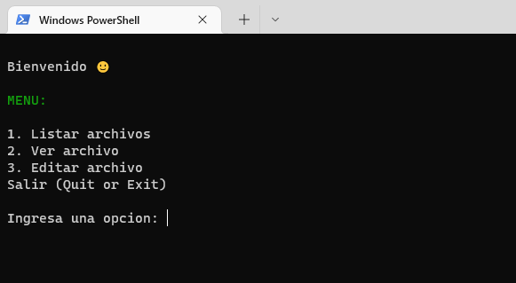
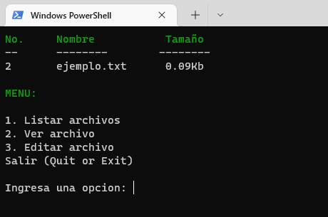

CLI de archivos en el sistema

Por Angelica Mendoza
========

## Funcionalidades
 * Lista los archivos en la carpeta actual
 * Ver contenido de un archivo
 * Añadir o reemplazar contenido de un archivo

## Ejecucion!

Para ejecutar el CLI hacer seguir los siguientes pasos en la terminal

    pip3 install colorama
    cd proyecto-bootcamp-1
    python main.py
